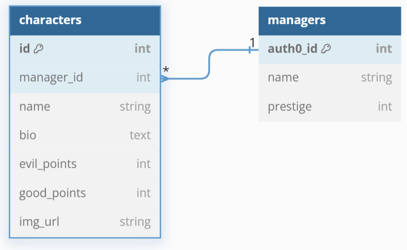

---

Are you a lost in the everlasting struggle to spot good from evil? Do you find it hard to know if a good Joel is turning bad, good, or maybe just neutJoel? Never fear, this project provides a social platform for outsourcing all of the guesswork to the most experienced experts, random users on the internet

## Setup

### 0. Cloning and installation

- [ ] Clone this repo, navigate to it, install packages, and start the server with `npm run dev`
  <details style="padding-left: 2em">
    <summary>Tip</summary>

    You may also want to start a new branch
    ```sh
    cd bad-characters-good-vibes
    npm i
    git checkout -b <branchname>
    npm run dev
    ```
  </details>

<details>
  <summary>More about using <code>npm</code> vs <code>npx</code></summary>

  - When running knex, run `npm run knex <command>`, e.g. `npm run knex migrate:latest` rather than using `npx`
</details>

---

## Building Blocks
---

### 1. Our user stories

#### MVP

1. As a user I want to see a page with two random characters and be able to click on a vote for which character is more evil/good
2. As a user I want to see a page of a random individidual character
3. As a user I want to see a page an individidual character when I select them
4. As a user I want to see a page all of the characters belonging to a manager
5. As a user I want to be able to sign in as a manager
6. As a user I want to see a page displaying all the top 5 most good/evil/neutral characters
7. As a manager I want to be able to create a new character and input their name and bio

#### MVP +

1. As a user on the main page I want to choose either a good or evil character based on the random question asked
2. As a user I want to see an interesting 404 page that references the current day
3. As a manager I want to be able to delete my characters
4. As a manager I want to be able to upload an image of my character as I create them
5. As a manager I want to be able to register with account details

#### Stretch

1. As a user I want to be able to see comments and comment on characters
2. As a user I want to generate a character with an AI and see it in the character rotation
3. As a manager I want to be able to search for images from an image API with a search box

### 2. Our tech stack

#### Core

- React, React Query, React Router
- Tailwind, PostCSS
- Express, SuperAgent
- Knex, SQLite3
- Vite, Typescript

#### Testing

- Vitest
- Testing Library 
- Supertest 
- Nock 

#### With extras from

- FontAwesome
- RadixUI, Headless UI React, Heroicons

#### Honorable Extension Mention

- Tailwind CSS IntelliSense

### 3. Our theme


Inspired by the soft coloured VSCode theme [Noctis](https://marketplace.visualstudio.com/items?itemName=liviuschera.noctis)

### 4. Our DB Schema (for now)

Note that the managers table is stretch



<details>
<summary>ERD code</summary>

```php
Table characters {
  id int [pk, increment]
  manager_auth0_id string [ref: > M.auth0_id]
  name string
  bio text
  evil_points int
  good_points int
  img_url string // default image at first
}

// Optional: auth0 stretch
Table managers as M {
  auth0_id string [pk]
  name string
  prestige int // combined character scores
}
```

</details>

---

## Snippets 🗓️

These are small snippets of code that may help you out. Note that this is not an exhaustive list, and you may need to mix and match concepts.

### Component

#### Fetch from Component

<details>
  <summary>Code:</summary>

```ts
// component.tsx
const { data: fruits, isLoading, isError } = useQuery({
  queryKey: ['fruits'], 
  queryFn: getFruits
})

if (isError) {
  return (/* ... */)
}

if (isLoading) {
  return (/* ... */)
}

return (/* ... */)
```

</details>

---

### API Client

#### Get Request

<details>
  <summary>Code:</summary>

```ts
// apis/fruits.ts
async function getFruits() {
  const response = await request
    .get('/api/v1/fruits')

  return response.body.fruits
}
```

</details>

### Express Routes

#### Getting Data (server-side)

<details>
  <summary>Code:</summary>

```ts
// server/routes/fruits.ts
router.get('/', (req, res) => {
  try {
    const fruits = await db.getFruits(userId)
    if(!fruits){
      res.status(400)
      return
    }

    // ...
    res.status(200).json({fruits})
  } catch (error) {
    // ...
    console.log(error.message)
    res.status(500).json({ message: 'There was an error loading the data'})
  }
})
```

</details>

---

### Database/Knex

#### Database Join

<details>
  <summary>Code:</summary>

```ts
// server/db/fuctions/reviews.ts
async function getFruits(): Promise<FruitWithComment[]> {
  //         table 1
  return (
    db('fruits')
      //     table 2     column 1     column 2
      .join('comments', 'fruits.id', 'comments.fruit_id')
      .select(
        // make sure column names end up being unique
        'fruits.id',
        'fruits.name',
        'fruits.color',
        'fruits.taste',
        'comments.tasteRating',
        'comments.textureRating',
        'comments.content'
      )
  )
}
```

</details>